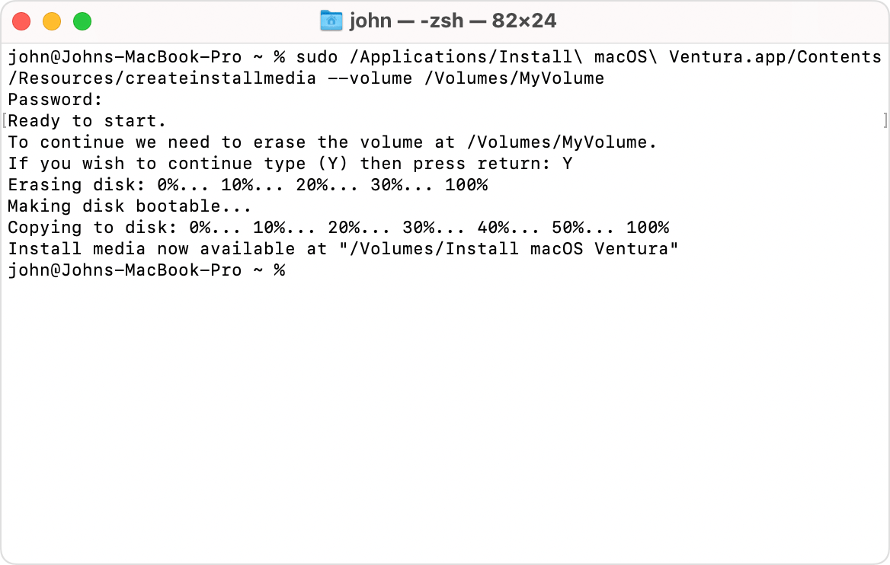

# MacOS Bootable Installer

You can use an external drive or secondary volume as a startup disk from which to install the MacOS.

You don't need a bootable installer to upgrade macOS or reinstall macOS, but it can be useful if you want to install macOS on multiple computers without downloading the installer each time, or if you're unable to install a compatible macOS from the Finder or macOS Recovery.

## What you need

- USB flash drive or other secondary volume with at least 14GB of available storage, formatted as Mac OS Extended (Journaled).
- Installer for OS X El Capitan or later.

To get the full installer, your Mac must be using the latest version of OS X El Capitan, the latest version of macOS Sierra, or any later version of macOS. Download from a Mac that is compatible with the macOS you're downloading.

The Mac App Store will be your main way to download macOS. You can download the following versions – 10.11, 10.12, 10.13, 10.14, 10.15, 11, 12, 13 & 14. Each link below will open up that version in the Mac App Store. All you need to do is, click the Download Button. When the download is finished, the installer will be in ```/Applications```.

[Sequoia (15)](https://apps.apple.com/us/app/macos-sequoia/id6596773750?mt=12)

[Sonoma (14)](https://apps.apple.com/us/app/macos-sonoma/id6450717509)

[Ventura (13)](https://apps.apple.com/us/app/macos-ventura/id1638787999)

[Monterey (12)](https://apps.apple.com/us/app/macos-monterey/id1576738294)

[Big Sur (11)](https://apps.apple.com/us/app/macos-big-sur/id1526878132?mt=12)

[Catalina (10.15)](https://apps.apple.com/us/app/macos-catalina/id1466841314?mt=12)

[Mojave (10.14)](https://apps.apple.com/us/app/macos-mojave/id1398502828?mt=12)

[High Sierra (10.13)](https://apps.apple.com/us/app/macos-high-sierra/id1246284741)

[Sierra (10.12)](https://apps.apple.com/us/app/macos-sierra/id1127487414)

[El Capitan (10.11)](https://apps.apple.com/us/app/os-x-el-capitan/id1147835434?mt=12)

## Use Terminal to create the bootable installer

<div align="left">
    </a>   
</div>
</br>

<ol>
<li> Plug in the USB flash drive or other volume that you're using for the bootable installer. </li>
<li> Open Terminal, which is in the Utilities folder of your Applications folder. </li>
<li> Type or paste one of the commands below into Terminal, then press Return to enter the command. Each command assumes that the installer is in your Applications folder, and MyVolume is the name of the USB flash drive or other volume you're using. If the volume has a different name, replace MyVolume in the command with the name of your volume. </li>
<li> When prompted, type your administrator password. The terminal doesn't show any characters as you type. Then press Return. </li>
<li> When prompted, type Y to confirm that you want to erase the volume, then press Return. The terminal shows the progress as the volume is erased. </li>
<li> After the volume is erased, you may see an alert that the terminal would like to access files on a removable volume. Click OK to allow the copy to proceed. </li>
<li> When the Terminal says that it's done, the volume will have the same name as the installer you downloaded, such as Install macOS Ventura. You can now quit Terminal and eject the volume. </li>
</ol>

## Commands

Depending on which macOS you downloaded, enter one of the following commands in Terminal as instructed above.
If your Mac is using macOS Sierra or earlier, the command should conclude with ```--applicationpath``` followed by the appropriate installer path, as shown in the command below for El Capitan.

### Sequoia
```
sudo /Applications/Install\ macOS\ Sequoia.app/Contents/Resources/createinstallmedia --volume /Volumes/MyVolume
```
### Sonoma
```
sudo /Applications/Install\ macOS\ Sonoma.app/Contents/Resources/createinstallmedia --volume /Volumes/MyVolume
```
### Ventura
```
sudo /Applications/Install\ macOS\ Ventura.app/Contents/Resources/createinstallmedia --volume /Volumes/MyVolume
```
### Monterey
```
sudo /Applications/Install\ macOS\ Monterey.app/Contents/Resources/createinstallmedia --volume /Volumes/MyVolume
```
### Big Sur
```
sudo /Applications/Install\ macOS\ Big\ Sur.app/Contents/Resources/createinstallmedia --volume /Volumes/MyVolume
```
### Catalina
```
sudo /Applications/Install\ macOS\ Catalina.app/Contents/Resources/createinstallmedia --volume /Volumes/MyVolume
```
### Mojave
```
sudo /Applications/Install\ macOS\ Mojave.app/Contents/Resources/createinstallmedia --volume /Volumes/MyVolume
```
### High Sierra
```
sudo /Applications/Install\ macOS\ High\ Sierra.app/Contents/Resources/createinstallmedia --volume /Volumes/MyVolume
```
### Sierra
```
sudo /Applications/Install\ macOS\ Sierra.app/Contents/Resources/createinstallmedia --volume /Volumes/MyVolume
```
### El Capitan
```
sudo /Applications/Install\ OS\ X\ El\ Capitan.app/Contents/Resources/createinstallmedia --volume /Volumes/MyVolume --applicationpath /Applications/Install\ OS\ X\ El\ Capitan.app
```
## Use the bootable installer

[Determine whether you're using a Mac with Apple silicon](https://support.apple.com/en-us/HT211814), then follow the appropriate steps:

### Apple Silicon

<ol>
<li> Plug the bootable installer into a Mac that is connected to the internet and compatible with the version of macOS you're installing. A bootable installer doesn't download macOS from the internet, but it does require an internet connection to get firmware and other information specific to the Mac model. </li>
<li> Turn on the Mac and continue to hold the power button until you see the startup options window, which shows your bootable volumes. </li>
<li> Select the volume containing the bootable installer, then click Continue. </li>
<li> When the macOS installer opens, follow the onscreen installation instructions. </li>
</ol>

### Intel Processor

<ol>
<li> Plug the bootable installer into a Mac that is connected to the internet and compatible with the version of macOS you're installing. A bootable installer doesn't download macOS from the internet, but it does require an internet connection to get firmware and other information specific to the Mac model. </li>
<li> Turn on your Mac, then immediately press and hold the Option (Alt) key. </li>
<li> Release the Option key when you see a dark screen showing your bootable volumes. </li>
<li> Select the volume containing the bootable installer. Then click the onscreen arrow or press Return. </li>
<li> Choose your language, if prompted. </li>
<li> Select Install macOS (or Install OS X) from the Utilities window, then click Continue and follow the onscreen instructions. </li>
</ol>

If you can't start up from the bootable installer, make sure that [Startup Security Utility](https://support.apple.com/en-us/HT208198) is set to allow booting from external or removable media.


